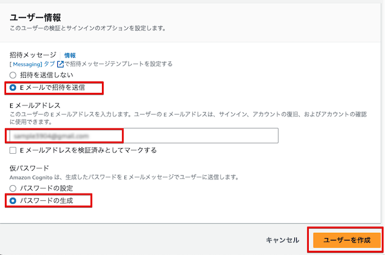
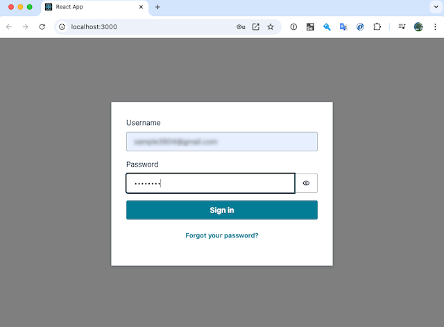

# sample-cognito-totp-mfa
Cognito Time-based One-time Password MFA Sample

## セットアップ

### (1) Download

```
% git clone https://github.com/furuya02/sample-cognito-totp-mfa.git
% cd sample-cognito-totp-mfa
```


### (2) CDK

* CDKでCognitoをセットアップします

```
% cd cdk
% npm install
% cdk deploy
Outputs:
CdkStack.CognitoClientId = xxxxxxxxxxxxxxxxxxxxxxxxx
CdkStack.CognitoPoolId = ap-northeast-1_xxxxxxxxx

% cd ..
```

* Output で出力された CognitoClientId 及び、CognitoPoolIdをコピーしておきます


### (3) React

* sample-cognito-totp-mfa/app/src/aws-exports.jsを、コピーしたIdで編集する

```
const awsmobile = {
  aws_project_region: "ap-northeast-1",
  aws_cognito_region: "ap-northeast-1",
  aws_user_pools_id: "ap-northeast-1_xxxxxxxxx",
  aws_user_pools_web_client_id: "xxxxxxxxxxxxxxxxxxxxxxxxx",
};

export default awsmobile;
```
* ローカルでサーバを起動する
 
```
% cd app
% npm install
% npm start

Compiled successfully!

You can now view app in the browser.

  Local:            http://localhost:3000
  On Your Network:  http://192.168.1.1:3000

```


## 使用方法

### (1) ユーザーの作成

* Cognitoのコンソールでユーザープールから「ユーザーを作成」を選択します


* 「Eメールで招待を送信」「パスワードの生成」を選択して、ユーザーを作成します



### (2) ユーザーのログイン（初回）

* ユーザーに招待メールが到着します


* 招待メールに記載されたパスワードでログインします



* ログイン後にパスワードの変更を行います


* 続いて、メールの検証を行います


* メールの検証が完了するとログインが完了します


### (3) ユーザーのMFA設定

* 「MFAを設定する」をクリックします


* 仮想MFAデバイスにシークレットを登録します


* 仮想MFAデバイスで生成されたワンタイムパスワードを入力して「保存」をクリックします


* 「現在、MFAは、アクティブになっています」と表示されたら登録完了です


### (4) ユーザーのログイン（MFA設定後）

* いったん「ログアウト」してログインを確認してみます


* メールアドレス及び、パスワードの認証が完了すると、ワンタイムパスワード入力に遷移します


* 仮想MFAで生成されたパスワードを入力します


* ログインに成功すると、「現在、MFAは、アクティブになっています」と表示されている事が確認できます


